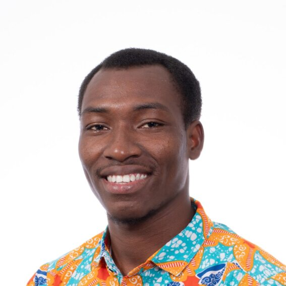

# nchagmado.github.io
My personal website

Jacob Nchagmado Tagnan is a Master's student at the [Florida State University](https://www.fsu.edu/) in the [Department of Geography](https://coss.fsu.edu/geography/), where he assist in teaching the "World Geography" course and other research activities. His research interest is in Geographic Information Systems, Artificial Intelligence (AI), GeoAI, Spatial Analysis, Urban and Regional Planning, Remote Sensing, Environmental Management, Climate Change and Disaster Management, Transport and Spatial Accessibilities, and Urban Growth Management

He is also an Urban Planning expert who has had his training at the Department of Planning, Kwame Nkrumah University of Science and Technology (KNUST), Ghana, where he graduated with a B.Sc. (Hons) degree in Human Settlement Planning from KNUST. He worked as a Teaching and Research Assistant in the Department of Planning, KNUST after graduation where he assisted in teaching, research, and supervision of students’ works as directed by his Superiors.

